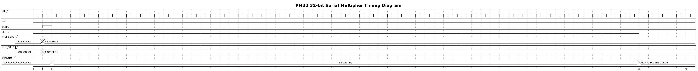

# PM32 Project - Design Specification

## Overview
The PM32 project implements a **32-bit signed serial multiplier** using the Serial Parallel Multiplier (SPM) algorithm. This design performs signed multiplication of two 32-bit operands over multiple clock cycles, producing a 64-bit result. The repository contains RTL design files, verification testbenches, and toolchain support for both simulation and physical implementation.

## Design Architecture

### Top-Level Module: pm32
The `pm32` module implements a finite state machine-controlled serial multiplier with the following interface:

#### Port Description
| Port | Direction | Width | Type | Description |
|------|-----------|-------|------|-------------|
| `clk` | Input | 1 | Wire | System clock |
| `rst` | Input | 1 | Wire | Active-high asynchronous reset |
| `start` | Input | 1 | Wire | Start multiplication operation |
| `mc` | Input | 32 | Wire (signed) | Multiplicand (32-bit signed) |
| `mp` | Input | 32 | Wire (signed) | Multiplier (32-bit signed) |
| `p` | Output | 64 | Reg (signed) | Product result (64-bit signed) |
| `done` | Output | 1 | Wire | Operation complete flag |
| `op` | Input | 1 | Wire | Operation select (unused, for TB compatibility) |

#### Operating Ranges
- **Input Range (mc, mp):** -2,147,483,648 to 2,147,483,647 (0x80000000 to 0x7FFFFFFF)
- **Output Range (p):** -4,611,686,018,427,387,904 to 4,611,686,018,427,387,903 (64-bit signed)

### State Machine
The multiplier operates using a 3-state FSM:

| State | Value | Description |
|-------|-------|-------------|
| `IDLE` | 0 | Waiting for start signal |
| `RUNNING` | 1 | Performing serial multiplication (64 cycles) |
| `DONE` | 2 | Operation complete, result available |

#### State Transitions
- `IDLE → RUNNING`: When `start` is asserted
- `RUNNING → DONE`: After 64 clock cycles (when `cnt == 64`)
- `DONE → RUNNING`: When `start` is asserted again
- `DONE → DONE`: When `start` is not asserted

### Serial Parallel Multiplier (SPM) Algorithm
The design uses a bit-serial approach where:
1. The multiplier (`mp`) is loaded into register `Y`
2. Each cycle, the LSB of `Y` is used to control partial product generation
3. The multiplicand (`mc`) is processed by the SPM module with the current multiplier bit
4. Results are accumulated by shifting the product register `p` right and inserting new partial products at the MSB
5. The process continues for 64 cycles to handle signed arithmetic properly

### Sub-Module: SPM
The SPM (Serial Parallel Multiplier) module performs the core partial product calculation:
- **Size Parameter:** Configurable width (32 bits for pm32)
- **Inputs:** `x` (multiplicand slice), `y` (multiplier bit), `clk`, `rst`
- **Output:** `p` (partial product bit)

## Timing Specifications

### Performance Characteristics
- **Latency:** 64 clock cycles per multiplication
- **Throughput:** 1 multiplication every 65+ cycles (including setup time)
- **Clock Frequency:** Design-dependent (limited by critical path in SPM module)

### Operation Sequence
1. **Setup Phase:** Assert `start` with valid `mc` and `mp` inputs
2. **Execution Phase:** 64 clock cycles of serial processing
3. **Completion Phase:** `done` asserted, result available on `p` output
4. **Next Operation:** New `start` pulse initiates next multiplication

### Timing Diagram
The following timing diagram illustrates the operation of the PM32 multiplier:



The diagram shows:
- **Reset Phase:** System reset clears all registers
- **Setup Phase:** Input operands `mc` and `mp` are applied with `start` signal
- **Execution Phase:** 64 clock cycles of serial multiplication processing
- **Completion Phase:** `done` signal asserted with valid result on `p` output
- **Example:** `0x12345678 × 0x1BCDEF01 = 0x01F721C28B9C1A98`

## Verification Environment

The PM32 project includes three different testbench architectures to accommodate different verification needs and user experience levels:

### 1. Simple Direct Testing (`test_my_dut.py`) - **Recommended for Beginners**

**Purpose:** Basic functional verification with straightforward test approach

**Framework:** Pure cocotb with direct DUT interaction

**Features:**
- Simple test functions with clear structure
- Randomized test cases for comprehensive coverage
- Direct signal manipulation and control
- Built-in timeout protection for robust testing
- Detailed logging and result reporting
- Easy to understand and modify for learning

**Test Coverage:**
- Random multiplication tests with 16-bit and 32-bit operands
- Edge cases: zero, one, maximum positive/negative values
- Corner cases: sign boundaries and mixed-sign operations
- Comprehensive result validation with expected vs. actual comparison

**Best for:** 
- Learning RTL verification concepts
- Quick functional debugging
- Simple design validation
- Educational purposes

### 2. Structured Cocotb Testbench (`testbench2.py`) - **Intermediate**

**Purpose:** Object-oriented verification with organized test structure

**Framework:** Cocotb with class-based architecture

**Features:**
- Test classes (BaseTester, RandomTester, MaxTester)
- Scoreboard functionality for automated result checking  
- Basic functional coverage tracking
- Reusable test components and inheritance
- Asynchronous task management
- Organized stimulus generation

**Test Architecture:**
- `BaseTester`: Base class with common test execution flow
- `RandomTester`: Generates random operands within specified ranges
- `MaxTester`: Tests with maximum boundary values
- `Scoreboard`: Automated result collection and verification
- Coverage tracking for operation types

**Best for:**
- Medium complexity verification projects
- Structured test development
- Reusable verification components
- Prototype and development testing

### 3. UVM-Based Testbench (`testbench.py`) - **Advanced**

**Purpose:** Industry-standard verification methodology using Universal Verification Methodology

**Framework:** pyUVM (Python implementation of SystemVerilog UVM)

**Features:**
- Complete UVM architecture with all standard components
- Sequence-based stimulus generation with inheritance
- Comprehensive scoreboard and coverage collection
- Modular and highly reusable verification environment
- Factory pattern for test configuration
- Professional-grade verification practices

**UVM Components:**
- **Driver (`Driver`):** Converts sequence items to pin-level stimulus
- **Sequencer:** Generates and manages test sequences (BaseSeq, RandomSeq, MaxSeq, MinSeq)
- **Monitor (`Monitor`):** Observes DUT interfaces and collects transactions
- **Scoreboard (`Scoreboard`):** Performs result checking with reference model
- **Coverage (`Coverage`):** Tracks functional coverage metrics
- **Environment (`DutEnv`):** Connects all verification components
- **Tests:** BaseTest, RandomTest, MaxTest, MinTest with factory overrides

**Test Sequences:**
- `RandomSeq`: Random 16-bit operands for comprehensive testing
- `MaxSeq`: Maximum positive values (0x7FFFFFFF)
- `MinSeq`: Maximum negative values (0x80000000)  
- Configurable through UVM factory mechanism

**Best for:**
- Large-scale verification projects
- Team-based development environments
- Formal verification requirements
- Enterprise-grade design validation
- Reusable verification IP development

## Switching Between Testbenches

To change between different testbench types, modify the `MODULE` variable in the `Makefile`:

### For Simple Direct Testing (Default - Recommended for New Users):
```makefile
MODULE = test_my_dut
```

### For Structured Cocotb Testbench:
```makefile
MODULE = testbench2
```

### For Advanced UVM Testbench:
```makefile
MODULE = testbench
```

### Running Simulations

After changing the module, run the simulation:
```bash
make clean
make sim
```

To run with waveforms for debugging:
```bash
make sim WAVES=1
```

To run specific tests (for UVM testbench):
```bash
make sim PLUSARGS="+UVM_TESTNAME=RandomTest"
make sim PLUSARGS="+UVM_TESTNAME=MaxTest"
```

### Testbench Comparison Summary

| Feature | test_my_dut.py | testbench2.py | testbench.py |
|---------|---------------|---------------|--------------|
| **Framework** | Pure Cocotb | Cocotb OOP | pyUVM |
| **Complexity** | Simple | Intermediate | Advanced |
| **Learning Curve** | Easy | Moderate | Steep |
| **Code Size** | Small (~200 lines) | Medium (~300 lines) | Large (~500+ lines) |
| **Stimulus Generation** | Direct Assignment | Class Methods | UVM Sequences |
| **Result Checking** | Direct Assertion | Basic Scoreboard | UVM Scoreboard |
| **Coverage** | Manual | Set-based | UVM Coverage |
| **Reusability** | Low | Medium | High |
| **Industry Standard** | No | Partial | Yes |
| **Best For** | Learning/Debug | Development | Production |

### Test Scenarios
All testbenches include comprehensive test scenarios:
1. **Random Tests:** Random operand generation within valid ranges
2. **Boundary Tests:** Maximum positive values (0x7FFFFFFF × 0x7FFFFFFF)  
3. **Corner Cases:** Maximum negative values (0x80000000 × 0x80000000)
4. **Edge Cases:** Zero multiplication, single-bit values
5. **Mixed Sign Tests:** Positive × Negative combinations

### Expected Results Validation
All testbenches include a Python reference model that:
- Converts unsigned inputs to signed 32-bit values using two's complement
- Performs reference multiplication: `result = A_signed × B_signed`
- Compares against DUT output for functional verification
- Reports pass/fail status with detailed error information

## Implementation Details

### Resource Utilization
- **Registers:** Approximately 100+ flip-flops (state, counters, data path)
- **Logic:** Combinational logic for FSM, SPM core, and data path
- **Memory:** No external memory required

### Tool Support
- **Simulation:** Verilator with cocotb/pyUVM testbenches
- **Synthesis:** Librelane RTL-to-GDS flow support
- **Configuration:** `config.json` for physical implementation

## Getting Started
To get started with this project, follow the steps below:

1. Clone the repository:
    ```bash
    git clone https://github.com/your-username/pm32.git
    ```
2. Navigate to the project directory:
    ```bash
    cd pm32
    ```
3. Run simulation (starts with simple testbench):
    ```bash
    make
    ```

## Files Structure
- `pm32.v` - Top-level multiplier module
- `spm.v` - Serial Parallel Multiplier core
- `test_my_dut.py` - Simple direct testing (recommended for beginners)
- `testbench2.py` - Structured cocotb testbench (intermediate)
- `testbench.py` - pyUVM-based verification environment (advanced)
- `tb_utils.py` - Testbench utilities and reference model
- `timing_diagram.puml` - PlantUML timing diagram source
- `timing_diagram.png` - Generated timing diagram image
- `Makefile` - Simulation build configuration
- `config.json` - Librelane synthesis configuration

## Contributing
Contributions are welcome! Please follow the steps below to contribute:

1. Fork the repository.
2. Create a new branch:
    ```bash
    git checkout -b feature-name
    ```
3. Commit your changes:
    ```bash
    git commit -m "Description of changes"
    ```
4. Push to the branch:
    ```bash
    git push origin feature-name
    ```
5. Open a pull request.

## License
This project is licensed under the MIT license. See the `LICENSE` file for details.

## Development Setup

To set up the development environment with code quality checks:

```bash
# Install pre-commit
pip install pre-commit

# Install the git hooks
pre-commit install

# (Optional) Run hooks on all files
pre-commit run --all-files
```

